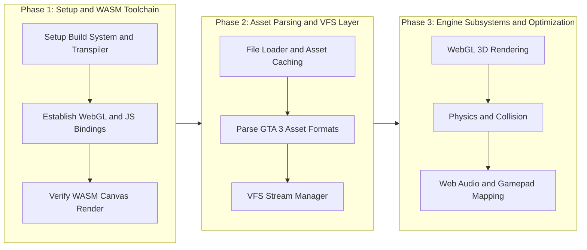
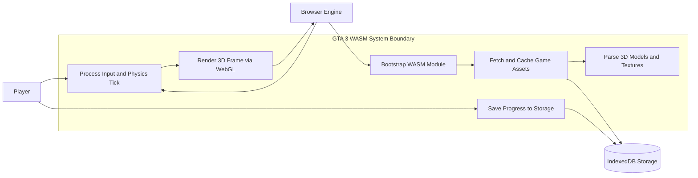
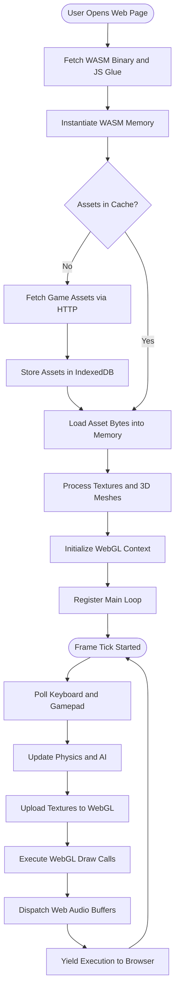

{ .tiet-logo }

**UCS503: Software Engineering (Project)**
**TIET Patiala**

# GTA3-WASM

**Author(s)**:

`(A)` Antriksh -- Roll No. `1024031034`
`(D)` Divam -- Roll No. `1024031032`

GTA3-WASM is a WebAssembly port of [re3](https://github.com/GTAmodding/re3)
-- a reverse-engineered, source-compatible build of Grand Theft Auto III --
so that it runs entirely in a browser tab via WebGL2, with no native
install and no plugin.

**This repository does not contain, download, or distribute any GTA III
game data.** You need your own legally obtained copy of GTA III (Steam,
GOG, a retail disc, etc.) -- this port only reads the same data files the
original PC game ships with, from wherever you point it.

## Repository layout

This repository follows the [UCS503P project
template](https://github.com/tiet-ucs503/ucs503p-202627odd-template):

- `project-proposal/`, `project-report-prototype-stage/`,
  `project-report-final/` -- the three LaTeX reports for the course.
- `journals/` -- one folder per team member, with weekly journal entries.
- `docs/` -- documentation, built and deployed as a website via `mkdocs`
  (see below). Includes the engineering write-ups for the WASM port
  (audio, input, threading, saves, WebGL compatibility, etc.).
- The engine/game source code, build scripts, and web frontend
  (`src/`, `vendor/`, `cmake/`, `web/`, `gamefiles/`, `CMakeLists.txt`,
  `premake5.lua`, ...) are kept at the repository root rather than under a
  `code/` folder, since this is a fork of the upstream `re3` build tree and
  moving it would break existing build tooling.

## Building & running

See [manual.md](manual.md) for the full build and run guide (prerequisites,
activating `emsdk`, building the WASM module, packaging game assets, and
running the local dev server).

## Docs

The `docs/` folder is an organised collection of markdown (`md`) files. The
build procedure uses the [`mkdocs`](https://www.mkdocs.org/) backend, using
[Material for MkDocs](https://squidfunk.github.io/mkdocs-material/). Any
commit to the `master`/`main` branch triggers a CI/CD-based build and
deployment of the documentation, including the journals (see
`.github/workflows/mkdocs.yml`).

For a local dev version of the docs, for viewing and testing, install the
local env (`pip install -r` the plugin list in
`.github/workflows/mkdocs.yml`, or see `pyproject.toml`) and run:

```shell
make docs
```

### Local `env` for `docs`

```shell
python -m venv .venv
source .venv/bin/activate   # or .venv\Scripts\activate on Windows
pip install mkdocs mkdocs-material mkdocs-material-extensions \
  mkdocs-literate-nav mkdocs-section-index \
  mkdocs-git-revision-date-localized-plugin \
  mkdocs-git-authors-plugin pymdown-extensions
```

## Credits & Upstream

This project builds directly on top of the
[re3](https://github.com/GTAmodding/re3) reverse-engineering project. All
credit for the reverse-engineered engine itself belongs to the `re3`/
GTAmodding contributors; this repository's original contribution is the
WebAssembly/browser port (build tooling, browser runtime shims, input,
audio, saves, and the web frontend under `web/`).

**System Architecture & Project Diagrams**

**1. Project Roadmap**


**2. System Architecture (Use Case Diagram)**


**3. Execution Lifecycle (Activity Diagram)**

